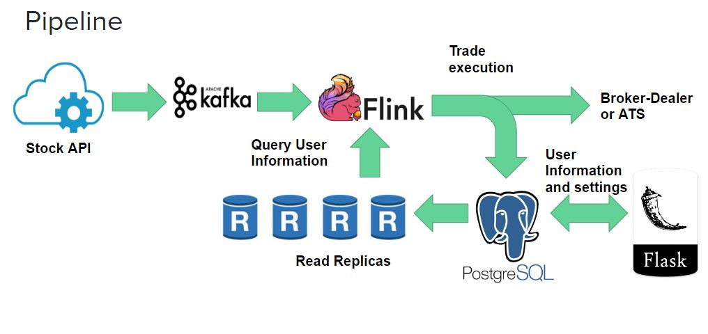

# Piper Trade - An Automatic Trading Platform

# Table of Contents
1. [Introduction](README.md#introduction)
2. [Details of Implementation](README.md#details-of-implementation)
3. [Repo directory structure](README.md#repo-directory-structure)

# Introduction
An application to process real time stream of stock prices and perform trades for each User based on User settings

The project url is at http://vishesh.trade

# Details of Implementation
The project is implemented using Kafka, Flink, Postgres and Flask.

## Pipeline

A Kafka python producer is used to generate the stock data which is ingested into a kafka topic.

This kafka topic is consumed by the flink cluster.

A 5 second moving average is computed, and the current price is compared with the 5 second moving average to determine if the price has increased or decreased.

Based on the price difference the user information is queried and trades are executed.

The transactions and user settings are stored in a Postgres DB.

The information for each user is then displayed in the front end using flask

## Repo Directory Structure

The directory structure for my repo looks like this:

    |____Flask app
    | |____app
    | | |____static
	| | | |____css
    | | | | |____stylesheet
    | | | |____js
    | | | | |____jquery.min
    | | |____templates
    | | |____views.py
    | | |______init__.py
    | |____tmp
    | |____run.py
    | |____tornadoapp.py
    |____Flink
	| |____src
	| | |____main
    | | | |____java
    | | | | |____org
	| | | | | |____myorg
    | | | | | | |____quickstart
    | | | | | | | |____main_job
    | | | |____resources
    | | | | |____log4j.properties
    | |____target
    | |____pom
    | |____quickstart.iml
    |____Kafka producer
	| |____kafka-thread.py
	| |____companylist
	
    
 - `Flask app`: Contains all necessary files (including style and HTML template files) to fun Flask.
 - `Flink`: This is my consumer. It receives the data stream from Kafka, encrypts the stream and inserts the encrypted data into a MySQL database.
 - `Kafka producer`: Reads the data (WiFi logs) from a csv file, formats it and streams to Kafka. Takes a Kafka topic in as an argument.
